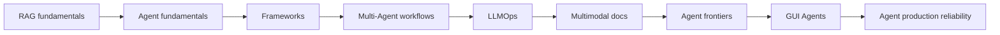

# Awesome Agent Engineering

> From hand-written RAG and ReAct loops to Agent systems that can be evaluated, observed, and deployed.

[中文](README.md) | **English**

[](https://github.com/kobejiasuoer/awesome-agent-engineering/actions/workflows/tests.yml)
[](https://www.python.org/)
[](#learning-path)
[](#verification)
[](LICENSE)

A hands-on **LLM application engineering course** for Python developers. Its 95 lessons follow one continuous path: hand-write the core mechanisms, translate them into LangChain and LangGraph, then integrate them into two tested projects with evaluation, APIs, and Docker support.

This repository goes beyond API recipes. It asks: **Why choose this design? What are the trade-offs? How can an experiment prove that a new mechanism actually helps?**

[Start in 5 minutes](#start-in-5-minutes) · [Learning path](#learning-path) · [Portfolio projects](#portfolio-projects) · [Contributing](CONTRIBUTING.md)

## At a glance

| Courses | Portfolio apps | Automated tests | Languages |
|---:|---:|---:|---:|
| 9 / 95 lessons | 2 | 362 | Chinese + English |

- **Principles before frameworks:** hand-written RAG, Function Calling, and ReAct are paired with framework implementations.
- **Evidence before claims:** RAGAS, ablations, trajectory evaluation, and local mini-benchmarks run through the curriculum.
- **Engineering beyond demos:** auth, rate limiting, tracing, caching, load testing, MCP, and Docker land in the portfolio apps.
- **Current topics:** multimodal documents, Agent memory, CodeAct, long-running tasks, GUI Agents, and Agent production reliability.

## See the results

| Enterprise Knowledge Base QA | AI Research Assistant |
|---|---|
| [](portfolio-projects/knowledge-base-qa/) | [](portfolio-projects/research-assistant/) |
| Hybrid retrieval, reranking, citations, multimodal parsing | Parallel research, review loops, memory, browser evidence |

> Screenshots were rendered from the local interfaces with illustrative data. External APIs are called only when you explicitly run an API-backed example.

## Start in 5 minutes

Run the dependency-free, API-key-free tour first:

```bash
python quickstart.py
python quickstart.py "How many annual-leave days after 5 years?"
```

The tour uses local character n-gram retrieval and a deterministic answerer. It exposes the RAG data flow without pretending to be a real LLM. Then run Lesson 01 with Zhipu AI:

```bash
python -m venv .venv

# Windows
.\.venv\Scripts\python.exe -m pip install -r requirements-quickstart.txt

# macOS / Linux
# .venv/bin/python -m pip install -r requirements-quickstart.txt

copy .env.example .env   # macOS / Linux: cp .env.example .env
# Set ZHIPUAI_API_KEY in .env
.\.venv\Scripts\python.exe rag-lessons\01_getting_started\code.py
```

Install `requirements.txt` only when you need the complete course stack; browser, OCR, and voice dependencies are intentionally not required for Lesson 01.

## Learning path



| Stage | Course | Main outcome | Progress |
|---|---|---|---:|
| Foundations | [Hand-written RAG](rag-lessons/) | Embeddings, retrieval, chunking, evaluation | 9/9 |
| Foundations | [Hand-written Agents](agent-lessons/) | Function Calling, ReAct, planning, memory | 9/9 |
| Engineering | [Framework Engineering](framework-lessons/) | LangChain, LangGraph, state, HITL | 9/9 |
| Architecture | [Multi-Agent Orchestration](workflow-lessons/) | Supervisors, swarms, subgraphs, parallelism | 9/9 |
| Production | [LLMOps](ops-lessons/) | Observability, security, MCP, performance and cost | 13/13 |
| Applied | [Multimodal Documents](doc-intelligence-lessons/) | PDF, OCR, tables, charts, citation provenance | 10/10 |
| Frontier | [Agent Frontiers](frontier-lessons/) | Memory, reflection, CodeAct, trajectory evaluation | 13/13 |
| Frontier | [GUI Agents](gui-agent-lessons/) | Browser control, vision, reliability, security | 13/13 |
| Production | [Agent production reliability](agent-ops-lessons/) | Step/cost budgets, circuit breaker, idempotent approvals, durable resume, chaos eval | 10/10 |

## Portfolio projects

| Project | Verifiable capabilities | Tests |
|---|---|---:|
| [Enterprise Knowledge Base QA](portfolio-projects/knowledge-base-qa/) | Hybrid retrieval + reranking, citations, RAGAS, auth, rate limits, MCP, multimodal parsing | 143 |
| [AI Research Assistant](portfolio-projects/research-assistant/) | LangGraph multi-Agent flow, SSE, reviews, memory, CodeAct, trajectory evaluation, browser evidence, production reliability | 219 |

Both projects expose FastAPI services, Docker setups, tests, and fallback paths when optional external capabilities are disabled. They are engineering references, not universal production-capacity guarantees; load-test and validate them in your own deployment environment.

<details>
<summary><strong>Expand the complete 85-lesson catalog</strong></summary>


## 📚 Course 1: Hand-written RAG (9 lessons)

Follows the real RAG data flow, adding one stage per lesson:

| # | Lesson | You'll learn |
|---|--------|--------------|
| 01 | [Get it running: your first RAG](rag-lessons/01_getting_started/) | Run the full pipeline end-to-end and build the big picture |
| 02 | [Deep dive into Embeddings](rag-lessons/02_embedding/) | How vectors represent semantics, cosine similarity |
| 03 | [Vector Retrieval](rag-lessons/03_retrieval/) | Top-K, ANN, and using Chroma |
| 04 | [Chunking](rag-lessons/04_chunking/) | The trade-offs of chunk_size / overlap |
| 05 | [Prompt Engineering](rag-lessons/05_prompt/) | Anti-hallucination prompts, citation grounding |
| 06 | [Advanced Retrieval](rag-lessons/06_advanced_retrieval/) | Hybrid retrieval + reranking |
| 07 | [Query Rewriting](rag-lessons/07_query_rewrite/) | HyDE, multi-query expansion |
| 08 | [RAG Evaluation](rag-lessons/08_evaluation/) | The three RAGAS dimensions |
| 09 | [Engineering: Capstone](rag-lessons/09_engineering/) | An interactive QA assistant integrating everything |

> All **9 lessons** done 🎉. Each lesson has a principle walkthrough + runnable code + exercises.

---

## 🤖 Course 2: Hand-written Agents (9 lessons)

Builds up agent capability layer by layer—each lesson adds one ability (tools → loop → memory → planning → collaboration):

| # | Lesson | You'll learn |
|---|--------|--------------|
| 01 | [Meet the Agent: from Q&A to action](agent-lessons/01_what_is_agent/) | Run a minimal agent; grasp "LLM + tools + decision" |
| 02 | [Function Calling in depth](agent-lessons/02_function_calling/) | Understand the function-calling mechanism; hand-write a generic tool dispatcher |
| 03 | [ReAct: the think-act-observe loop](agent-lessons/03_react_loop/) | Hand-write a minimal ReAct loop (no framework; an interview staple) |
| 04 | [Multiple tools & tool design](agent-lessons/04_tool_design/) | Trade-offs across 5+ tools; how description quality affects selection |
| 05 | [Memory: remembering context](agent-lessons/05_memory/) | Multi-turn dialogue, context-window limits and handling strategies |
| 06 | [Planning & task decomposition](agent-lessons/06_planning/) | The Plan-and-Execute paradigm vs ReAct, and when to use which |
| 07 | [Agentic RAG: Agent + RAG](agent-lessons/07_agentic_rag/) | Wrap RAG as a tool; let the agent decide when to retrieve |
| 08 | [Multi-agent collaboration](agent-lessons/08_multi_agent/) | Multiple agents, each with a role, cooperate on complex tasks |
| 09 | [Capstone: smart research assistant](agent-lessons/09_capstone/) | Web search + structured research report (résumé-grade) |

> All **9 lessons** done 🎉. Each lesson has a principle walkthrough + runnable code + exercises.

---

## 🔧 Course 3: Framework Engineering (9 lessons)

Re-implement what you hand-wrote in the first two courses with **LangChain / LangGraph**, comparing "hand-written vs framework" each lesson:

| # | Lesson | You'll learn |
|---|--------|--------------|
| 01 | [LCEL & the framework landscape](framework-lessons/01_lcel_overview/) | Hand-written RAG vs LCEL—see what the framework does for you |
| 02 | [The trio: Models + Prompts + Parsers](framework-lessons/02_models_prompts_parsers/) | Standardized building blocks for calling models, writing prompts, parsing output |
| 03 | [Documents: Loaders + Splitters + VectorStores](framework-lessons/03_documents_splitter_vectorstore/) | The engineering pipeline for getting data in |
| 04 | [Retrievers + RAG Chain](framework-lessons/04_retrievers_rag_chain/) | Compose blocks with `\|` into a full RAG chain |
| 05 | [Advanced retrieval engineering](framework-lessons/05_advanced_retrieval/) | Ensemble + MultiQuery—where the framework really pays off |
| 06 | [LangGraph basics](framework-lessons/06_langgraph_basics/) | Rewrite ReAct with StateGraph (the pivot from LangChain to LangGraph) |
| 07 | [Framework-level Agents](framework-lessons/07_tools_and_agents/) | `@tool` decorator + `create_agent`—dozens of hand-written lines in a few |
| 08 | [State, memory & human-in-the-loop](framework-lessons/08_state_memory_hitl/) | Checkpointer persistence + interrupt HITL (LangGraph's killer feature) |
| 09 | [Capstone: LangGraph research assistant](framework-lessons/09_capstone/) | Multi-node graph + Checkpointer, integrating all framework skills |

> All **9 lessons** done 🎉. Each lesson has a principle walkthrough + runnable code + exercises.

---

## 🔀 Course 4: Workflow & Multi-Agent Orchestration (9 lessons)

The first three courses cover "single agent + single flow." This course moves into **multi-agent orchestration**—a core skill for the AI architect track. LangGraph is the backbone for 6 classic topologies, then CrewAI / AutoGen are used for cross-paradigm comparison on the same problem:

| # | Lesson | You'll learn |
|---|--------|--------------|
| 01 | [Supervisor pattern](workflow-lessons/01_supervisor_pattern/) | Centralized dynamic routing (vs the hard-coded loop from hand-written L08) |
| 02 | [Swarm & Handoff](workflow-lessons/02_swarm_handoff/) | Decentralized swarm + state handoff (vs hand-written string concatenation) |
| 03 | [Subgraphs](workflow-lessons/03_subgraph/) | Embed a compiled graph as a node for modular reuse |
| 04 | [Parallel Map-Reduce](workflow-lessons/04_parallel_mapreduce/) | fan-out burst + reducer merge (parallelism hand-writing can't do) |
| 05 | [Shared-state communication](workflow-lessons/05_shared_state/) | Compare messaging / shared state / blackboard |
| 06 | [Multi-model routing & topology](workflow-lessons/06_multimodel_routing/) | Star / ring / mesh / hierarchical topologies + cost control |
| 07 | [CrewAI comparison](workflow-lessons/07_crewai_comparison/) | Role-driven declarative orchestration vs LangGraph supervisor |
| 08 | [AutoGen comparison](workflow-lessons/08_autogen_comparison/) | Conversation-driven group chat vs LangGraph swarm |
| 09 | [Capstone: multi-agent research system](workflow-lessons/09_capstone/) | supervisor + parallel + shared state + multi-model (résumé-grade) |

> All **9 lessons** done 🎉. Each lesson keeps the "hand-written Agent L08 pipeline vs framework multi-agent" side-by-side. The L09 capstone integrates all of L01–L08 and is a résumé-grade piece.

---

## 🛡️ Course 5: LLMOps in Production (13 lessons)

The first four courses teach you to **build** an AI app; this one teaches you to **operate** it—answering the interviewer's "and after your project goes live? How do you know it's good, defend against attacks, get integrated by other systems, control cost?" All changes land directly on **knowledge-base-qa**, upgrading it from "running demo" to "ops-ready v2." Four modules, progressively:

| # | Lesson | You'll learn |
|---|--------|--------------|
| 01 | [Structured logging](ops-lessons/01_structured_logging/) | From print to queryable JSON event streams + trace_id across the chain |
| 02 | [Langfuse end-to-end tracing](ops-lessons/02_langfuse_tracing/) | Visualize per-query retrieval / rerank / generation latency, tokens, cost |
| 03 | [Online eval loop](ops-lessons/03_online_eval/) | Real-query sampling + automated ragas scoring + bad-answer queue |
| 04 | [API auth & rate limiting](ops-lessons/04_auth_ratelimit/) | Key auth + per-key rate limiting—prevent open access and runaway bills (401/429/200) |
| 05 | [Prompt injection offense/defense](ops-lessons/05_prompt_injection/) | Indirect injection (malicious instructions hidden in docs) + build an attack test set and run a breach baseline |
| 06 | [I/O guardrails](ops-lessons/06_guardrails/) | Material isolation + instruction/data separation + output filtering, hardened into CI |
| 07 | [What is MCP](ops-lessons/07_mcp_basics/) | The "USB port" for AI apps: M×N→M+N; hand-write a minimal server/client |
| 08 | [Wrap the KB as an MCP Server](ops-lessons/08_mcp_server/) | Expose kb-qa retrieval as a standard tool; any host integrates with zero code |
| 09 | [Agent as MCP Client](ops-lessons/09_mcp_client/) | research-assistant calls kb-qa—connecting the two portfolio projects |
| 10 | [Semantic caching](ops-lessons/10_semantic_cache/) | Cache hits on synonymous queries, skipping retrieval + generation |
| 11 | [Load testing & concurrency](ops-lessons/11_loadtest/) | QPS / P95 / P99 baselines; locate the bottleneck at the upstream API limiter |
| 12 | [Cost/quality trade-offs](ops-lessons/12_cost_quality/) | Quantify glm-4 vs flash on eval data; per-stage model selection to cut cost |
| 13 | [Capstone: ops-ready v2](ops-lessons/13_capstone/) | An ops dashboard + a production launch checklist tying all 12 lessons together |

> All **13 lessons** done 🎉. Teaching `code.py` files are all zero-dependency or have mock fallback paths so they run standalone; production changes go into kb-qa with a "## rollout checklist." Places that can't run real external services (Langfuse / Docker / load testing) are **honestly marked as unverified** with a fallback path.

---

## 📄 Course 6: Multimodal Document Intelligence (10 lessons)

The first five courses built a RAG pipeline that only eats "clean plain text"—but real enterprise knowledge bases are full of scans, tables, and charts, which a text-only pipeline is blind to. This course teaches **converged engineering knowledge** (document parsing / OCR / table handling have mature industry practices), upgrading kb-qa from "text-only" to a "multimodal document intelligence system v3 that eats scans / tables / charts with citations traceable to page + region." The tone aligns with the ops course (standard practices + trade-offs); every lesson has a "## approach comparison" section. Two through-lines: ① cost-accuracy (every multimodal decision trades cost for accuracy); ② provenance (citations upgrade from chunk text to doc name + page + region).

| # | Lesson | What you learn |
|---|--------|----------------|
| 00 | [Overview & baseline](doc-intelligence-lessons/00_baseline/) | Real enterprise doc composition + quantifying the text-RAG ceiling (scan/table/chart questions at 0%) + poison doc set + bare baseline |
| 01 | [PDF anatomy & layout parsing](doc-intelligence-lessons/01_pdf_layout/) | PDF three-layer structure + a layout-aware parser (Element with type and bbox) + classification routing |
| 02 | [Tables: from serial text to structured](doc-intelligence-lessons/02_table/) | pdfplumber extraction + a markdown/HTML/serial three-representation comparison experiment + whole-table chunking with header redundancy |
| 03 | [Scans: three OCR routes](doc-intelligence-lessons/03_ocr/) | Local RapidOCR vs VLM direct read vs confidence-routed hybrid (a textbook cost-accuracy case) |
| 04 | [Charts & image understanding](doc-intelligence-lessons/04_chart_vision/) | glm-4v-plus two-stage (description cache for indexing + live image read for answering) + hash dedup |
| 05 | [Multimodal retrieval](doc-intelligence-lessons/05_multimodal_retrieval/) | Description indexing makes charts searchable + element_type routing + CLIP dual-tower comparison |
| 06 | [Citation provenance upgrade](doc-intelligence-lessons/06_citation/) | Citations upgrade from chunk text to page + region (bbox) + region clip images + credibility trilogy step 3 |
| 07 | [Voice entry (exploratory)](doc-intelligence-lessons/07_voice/) | ASR → kb-qa → TTS full pipeline + latency breakdown (voice is an entry point, not the core) |
| 08 | [Multimodal evaluation: gains table](doc-intelligence-lessons/08_evaluation/) | Per-mechanism switch matrix + anti-regression control + ragas multimodal blind spot + ingest cost column |
| 09 | [Capstone: v3 + renumbering](doc-intelligence-lessons/09_capstone/) | All mechanisms协同 on the hard task + kb-qa v3 finalization + repo-wide course renumbering |

> All **10 lessons** done 🎉. **Two through-lines:** ① cost-accuracy (VLM direct read is expensive but strong, local OCR is cheap but brittle—classification routing is the engineering answer); ② provenance (citations upgrade from chunk text to doc name + page + region, the third step of the credibility trilogy). All new mechanisms default off (`enable_multimodal_ingest` etc.), existing tests stay green, every lesson has a "## approach comparison" + at least one "design experiment" exercise.

---

## 🧠 Course 7: Agent Frontiers (13 lessons)

The first six courses teach **converged knowledge** (how to chunk for RAG, how to write ReAct). This course teaches **not-yet-converged frontiers**—agent memory, reflection, Code Agents, trajectory evaluation, context engineering—where the industry has no standard answer. So the style changes: the README doesn't lecture "the standard way," it lays out "which schools of thought exist, what the trade-offs are, and why we picked X…"; the code is "hand-write the core mechanism + a design experiment to test whether it helps." All changes land on **research-assistant**, growing it from a one-shot "search → write report" system into a **cross-session Deep Research Agent v2**. Six modules:

| # | Lesson | You'll learn |
|---|--------|--------------|
| 00 | [Method warm-up](frontier-lessons/00_method/) | The three-pass paper reading method + reading LangGraph source + running an amnesiac baseline (reference throughout) |
| 01 | [Memory tiers](frontier-lessons/01_memory/) | Episodic (Chroma) + semantic (list) MemoryStore; researcher gets `recall` |
| 02 | [Reflective writes](frontier-lessons/02_reflection_write/) | `reflect_and_store` distills memory + `consolidate` reinforces + forgetting policy |
| 03 | [Skills & context engineering](frontier-lessons/03_skills/) | Progressive `skill_loader`; unify memory / skills / RAG / MCP under context engineering |
| 04 | [Hand-written Reflexion](frontier-lessons/04_reflexion/) | Three-component loop + blind-retry vs reflective-retry comparison + ablation |
| 05 | [Reflection into the research loop](frontier-lessons/05_reflection_research/) | Dual-channel reviewer (text + facts) + conflict detection + targeted re-research and correction |
| 06 | [Hand-written CodeAct](frontier-lessons/06_codeact/) | Code as the action space + process-level sandbox (import allowlist / timeout / truncation) |
| 07 | [Code interpreter lands](frontier-lessons/07_code_interpreter/) | `code_interpreter` wired into writer; report numbers become reproducible |
| 08 | [Trajectory evaluation](frontier-lessons/08_trajectory_eval/) | TrajectoryEvaluator: success rate / steps / loops / attribution + mechanism-trigger detection |
| 09 | [Eval Harness](frontier-lessons/09_eval_harness/) | Switch matrix × task set = mechanism-gains table (regression-style eval) |
| 10 | [Long-horizon tasks](frontier-lessons/10_long_task/) | TaskLedger: TODO tree + resume-from-checkpoint + incremental briefings |
| 11 | [Capstone](frontier-lessons/11_capstone/) | Deep Research v2: five mechanisms in concert + architecture doc + gains table |
| 12 | [Frontier-tracking method](frontier-lessons/12_frontier_tracking/) | Full three-pass reading method + framework evaluation checklist + minimal multi-agent memory-sharing repro |

> All **13 lessons** done 🎉. **Two through-lines:** ① an evaluation main line (L00 sets the baseline → L08 builds the evaluator → L09 harness quantifies every mechanism's gain); ② a context-engineering main line (memory / skills / RAG / MCP unified under the one question "what goes in the window"). Each lesson's README has a "schools of thought" section + at least one "design experiment to validate" exercise. 104 unit tests green; all new mechanisms default-off, with intact fallback paths.

---

## 🖥️ Course 8: GUI Agent / Computer Use (13 lessons)

The first seven courses grew research-assistant into a deep agent that **thinks**—but it only has a brain, no hands: its sole channel to the world is search snippets. This course teaches a **frontier that is still unconverged in 2025–2026**: letting the agent operate a browser directly (open pages, click, paginate, extract, download), growing research-assistant a pair of hands that are **steady, safe, and measurable**. The style continues Course 7: READMEs lay out "the three schools of thought (text / vision / dedicated models), their trade-offs, and why we pick X…"; the code is "hand-write the core mechanism + a design experiment to test whether it helps." All changes land on research-assistant; `enable_browser` defaults to off, and all 123 tests stay green.

| # | Lesson | You'll learn |
|---|--------|--------------|
| 00 | [Landscape & baseline](gui-agent-lessons/00_overview/) | Map of the three schools + WebArena/SeeAct/OSWorld primer + hard-task definition + run the bare baseline (what search snippets can't get you) |
| 01 | [Playwright foundations](gui-agent-lessons/01_playwright/) | Deterministic BrowserSession control (auto-wait / timeout fallback / context manager) + slow-load & popup pages |
| 02 | [Observation space](gui-agent-lessons/02_observation/) | page_to_obs with three page representations (raw HTML / numbered element list / plain text) + token comparison (9x savings) |
| 03 | [Action space](gui-agent-lessons/03_action/) | Constrained action DSL (click/type/scroll/back/finish) + parse & validate + structured error feedback for illegal actions |
| 04 | [Minimal GUI Agent](gui-agent-lessons/04_text_agent/) | observe→think→act loop + sliding-window context trimming + mock-LLM zero-API run |
| 05 | [Vision route](gui-agent-lessons/05_vision/) | SoM-annotated screenshots into glm-4v-plus + text/vision/hybrid same-task comparison (tokens / success rate) |
| 06 | [Reliability engineering](gui-agent-lessons/06_reliability/) | Failure-mode checklist + loop detection (observation hashing) + strategy switching + tricky-page before/after |
| 07 | [Web injection offense & defense](gui-agent-lessons/07_injection/) | GUI injection is an order of magnitude worse than RAG (doing wrong vs saying wrong) + action-layer defense (allowlist / sensitive-action confirmation / injection scanning) |
| 08 | [Evaluation mini-benchmark](gui-agent-lessons/08_benchmark/) | The WebArena idea: self-hosted local task set + functional acceptance + two-layer eval with the trajectory evaluator |
| 09 | [Landing: growing "hands"](gui-agent-lessons/09_browser_tool/) | browser_tool.py wired into researcher (async + security on by default + fallback chain + 17 tests) |
| 10 | [Deep browsing & evidence chains](gui-agent-lessons/10_evidence/) | deep_browse multi-step evidence gathering + evidence chains (URL + access time + snapshot) + revisitable report citations |
| 11 | [Capstone](gui-agent-lessons/11_capstone/) | A web-browsing Deep Research Agent: four layers in concert + architecture doc + gains table (success rate 75%→100%) |
| 12 | [Frontier tracking](gui-agent-lessons/12_frontier/) | Dedicated models vs general VLM + scaffolding: a three-axis framework + a minimal SoM-ablation repro |

> All **13 lessons** done 🎉. **Two through-lines:** ① an evaluation main line (L00 bare baseline → L08 mini-benchmark → L11 gains table quantifying every mechanism); ② an observation–action interface main line (L02 observation space → L03 action DSL → L04 loop closure—the context-engineering theme extended to GUI). Each lesson's README has a "schools of thought" section + at least one "design experiment to validate" exercise. Landing adds 19 browser tests to research-assistant (123 total, all green); `enable_browser` defaults to off with intact fallback paths.

</details>

## 🛡️ Course 9: Agent Production Reliability / AgentOps (10 lessons)

> ops-lessons protects **a single request** (auth, rate limiting, guardrails); this course protects **a trajectory**—an Agent that loops many times and decides its own next step, so the failure modes are fundamentally different: infinite loops, cost blowouts, fault propagation, dangerous side effects, mid-run crashes. kb-qa is a linear chain that doesn't need these mechanisms; research-assistant is a loop body that can't ship without them—this asymmetry is itself evidence of the boundary. The style follows ops-lessons (teaching "the standard practice + the trade-offs"); each lesson has a "comparison of approaches" section. All changes land on **research-assistant**, upgrading it from the capable "Deep Research Agent v2" into a **production-reliable v3: survives faults, gates dangerous actions, recovers from crashes, and has SLO numbers**. Ten modules:

| # | Lesson | What you learn |
|---:|---|---|
| 00 | [Landscape & baseline](agent-ops-lessons/00_overview/) | Request-guard vs trajectory-guard boundary + risk map + six-fault chaos suite + bare baseline (all blast radii unbounded) |
| 01 | [Steps & loops](agent-ops-lessons/01_step_budget/) | Global step budget (add_int reducer) + action-signature loop detection + honest truncation (partial result, not a crash) |
| 02 | [Cost budget](agent-ops-lessons/02_cost_budget/) | Trajectory-level token wallet (usage_metadata metering) + soft-budget downgrade / hard-budget truncate + per-node cost table |
| 03 | [Timeout, circuit breaker & honest degradation](agent-ops-lessons/03_breaker_degrade/) | Hand-written 3-state circuit breaker + structured degradation protocol + fallback chain |
| 04 | [Side effects & idempotency](agent-ops-lessons/04_sideeffect_idempotent/) | Side-effect classification + idempotency key (thread_id + content hash) + sqlite registry + dry-run + optional publish node |
| 05 | [Human-in-the-loop approval](agent-ops-lessons/05_hitl_approval/) | langgraph interrupt/resume gate + policy layering (first_only reuses the idempotency key) + cross-process resume |
| 06 | [Durable resume](agent-ops-lessons/06_durable_resume/) | jobs registry + checkpoint resume (completed nodes not re-run) + recover_orphans + boundary vs frontier-L10 ledger |
| 07 | [Trajectory observability](agent-ops-lessons/07_observability/) | One-line run-summary health report + threshold alerts + three-layer split with request logs / evaluation |
| 08 | [Reliability evaluation](agent-ops-lessons/08_chaos_eval/) | Chaos gains matrix (six faults × all-off/all-on) + SLO card + clean-run zero-tax regression (success 33%→100%) |
| 09 | [Capstone](agent-ops-lessons/09_capstone/) | End-to-end with all mechanisms + research-assistant v3 finalization + seven-mechanism governance + repo-wide Course 9 registration |

> All **10 lessons** done 🎉. **Two through-lines:** ① a blast-radius main line (L00 measures five unbounded failure modes → each lesson bounds one: loops→step-bounded, cost→budget-bounded, faults→degradation-bounded, side-effects→idempotent+approval-bounded, crashes→redo-bounded); ② an autonomy-vs-control main line (every protection trades autonomy/latency/human-effort for safety—too tight and the Agent is useless, too loose and it's reckless; each lesson gives the "when tight, when loose" criterion). Each lesson's README has a "comparison of approaches" section + at least one "design experiment" exercise. Landing adds 96 tests to research-assistant (219 total, all green); all new mechanisms default off with zero tax on clean runs.

## Verification

```bash
python -m pytest portfolio-projects/knowledge-base-qa/tests -q
python -m pytest portfolio-projects/research-assistant/tests -q
```

External model calls are mocked by default so CI remains reproducible. Real-model evaluation and load-test methods live in each project's `eval/` and `loadtest/` directories; environment-dependent numbers should not be treated as production promises.

---

## 📁 Directory Structure

```
RAG-test/
├── README.md                  ← Course index (Chinese)
├── README.en.md               ← You are here: nine courses + portfolio overview (English)
├── requirements.txt           ← Dependencies (shared across all nine courses)
├── .env.example               ← API key config template
├── data/sample_docs/          ← Sample docs for exercises (shared across courses)
├── data/multimodal_docs/      ← Multimodal course poison doc set (scan/table/chart PDF + golden questions)
├── rag-lessons/               ← Course 1: Hand-written RAG (9 lessons, done)
├── agent-lessons/             ← Course 2: Hand-written Agents (9 lessons, done)
├── framework-lessons/         ← Course 3: Framework Engineering (9 lessons, done)
├── workflow-lessons/          ← Course 4: Workflow & Multi-Agent Orchestration (9 lessons, done)
├── ops-lessons/               ← Course 5: LLMOps in Production (13 lessons, done)
├── doc-intelligence-lessons/  ← Course 6: Multimodal Document Intelligence (10 lessons, done)
├── frontier-lessons/          ← Course 7: Agent Frontiers (13 lessons, done)
├── gui-agent-lessons/         ← Course 8: GUI Agent / Computer Use (13 lessons, done)
├── agent-ops-lessons/         ← Course 9: Agent Production Reliability / AgentOps (10 lessons, done)
├── portfolio-projects/        ← 🚀 Production-grade portfolio projects (landings after the courses; main battleground for ops/docint/frontier/gui/agentops)
│   ├── knowledge-base-qa/     ←   Enterprise KB QA (RAG, multimodal document intelligence v3)
│   └── research-assistant/    ←   AI Research Assistant (multi-agent + FastAPI + Docker, production-reliable v3)
└── docs/                      ← Design docs and implementation plans
```

Each lesson ships as a fixed trio: **① a principles README (the why and the trade-offs) + ② a runnable `code.py` (with detailed comments) + ③ exercises.**
Portfolio projects use a **modular engineering layout** (`src/` + `api/` + `tests/` + `Docker`), organized to production standards.

---

## 💡 Study Tips

- **Run the code.** Don't just read. A lot of RAG intuition comes from changing parameters yourself and watching the output change.
- Learn in order—each lesson builds on the previous one.
- Each lesson contains a principles README, runnable `code.py`, and experiments. Run the baseline before changing parameters.
- Use the GitHub issue templates for bugs and lesson feedback.

---

## Contributing

Corrections, cross-platform fixes, model adapters, and reproducible experiments are welcome. Read [CONTRIBUTING.md](CONTRIBUTING.md) before opening a pull request, see [CHANGELOG.md](CHANGELOG.md) for release changes, and report security issues privately according to [SECURITY.md](SECURITY.md).

MIT License · Thanks to the [Linux.do](https://linux.do/) community for its support.
