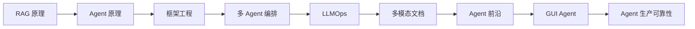

# Awesome Agent Engineering

> 从手写 RAG 与 ReAct，到可评估、可观测、可部署的 Agent 系统。

**中文** | [English](README.en.md)

[](https://github.com/kobejiasuoer/awesome-agent-engineering/actions/workflows/tests.yml)
[](https://www.python.org/)
[](#课程路线)
[](#可验证性)
[](LICENSE)

这是一套面向 Python 开发者的 **LLM 应用工程实战课程**。95 节课程沿同一条主线递进：先手写核心机制，再用 LangChain / LangGraph 工程化，最后落到两个带测试、评估、API 与 Docker 的完整项目。

这里不只展示“怎么调 API”，还会回答三个更难的问题：**为什么这样设计、不同方案如何取舍、加入一个机制后怎样证明它真的有效。**

[5 分钟开始](#5-分钟开始) · [查看课程路线](#课程路线) · [查看作品项目](#作品项目) · [参与贡献](CONTRIBUTING.md)

## 项目一览

| 课程 | 作品项目 | 自动化测试 | 语言 |
|---:|---:|---:|---:|
| 9 门 / 95 节 | 2 个 | 362 项 | 中文 + English |

- **从原理到框架**：RAG、Function Calling、ReAct 都先手写，再对照框架实现。
- **从结果到证据**：RAGAS、消融实验、Agent 轨迹评估与 mini-benchmark 贯穿课程。
- **从 Demo 到工程**：鉴权、限流、日志、追踪、缓存、压测、MCP、Docker 都落到作品项目。
- **覆盖新方向**：多模态文档理解、Agent Memory、CodeAct、长任务、GUI Agent 与 Agent 生产可靠性。

## 先看结果

| 企业知识库问答 | AI 研究分析助手 |
|---|---|
| [](portfolio-projects/knowledge-base-qa/) | [](portfolio-projects/research-assistant/) |
| 混合检索、rerank、引用溯源、多模态解析 | 多 Agent 并行研究、审稿回路、记忆、浏览器取证 |

> 截图使用本地界面与演示数据生成；项目默认不会调用外部 API，只有显式运行时才会产生模型费用。

## 5 分钟开始

先运行零依赖、零 API Key 的离线导览，观察一次完整的“查询向量化 → 检索 → 组装上下文 → 回答”流程：

```bash
python quickstart.py
python quickstart.py "入职满 5 年有多少天年假？"
```

离线导览使用字符 n-gram 检索和确定性回答器，目的是让你先看清数据流，不冒充真实 LLM。随后运行第一节真实 RAG：

```bash
python -m venv .venv

# Windows
.\.venv\Scripts\python.exe -m pip install -r requirements-quickstart.txt

# macOS / Linux
# .venv/bin/python -m pip install -r requirements-quickstart.txt

copy .env.example .env   # macOS / Linux: cp .env.example .env
# 在 .env 中填写 ZHIPUAI_API_KEY
.\.venv\Scripts\python.exe rag-lessons\01_getting_started\code.py
```

完整课程依赖按需安装：`python -m pip install -r requirements.txt`。浏览器、OCR、语音组件较重，不需要在第一课一次装完。

## 课程路线



| 阶段 | 课程 | 核心产出 | 进度 |
|---|---|---|---:|
| 基础 | [RAG 手写](rag-lessons/) | embedding、检索、切块、评估 | 9/9 |
| 基础 | [Agent 手写](agent-lessons/) | Function Calling、ReAct、规划、记忆 | 9/9 |
| 工程 | [框架进阶](framework-lessons/) | LangChain、LangGraph、状态与 HITL | 9/9 |
| 架构 | [多智能体编排](workflow-lessons/) | supervisor、swarm、子图、并行 | 9/9 |
| 生产 | [LLMOps](ops-lessons/) | 可观测性、安全、MCP、性能与成本 | 13/13 |
| 场景 | [多模态文档智能](doc-intelligence-lessons/) | PDF、OCR、表格、图表、引用溯源 | 10/10 |
| 前沿 | [智能体前沿](frontier-lessons/) | 记忆、反思、CodeAct、轨迹评估 | 13/13 |
| 前沿 | [GUI Agent](gui-agent-lessons/) | 浏览器控制、视觉路线、可靠性与安全 | 13/13 |
| 生产 | [Agent 生产可靠性](agent-ops-lessons/) | 步数/成本预算、熔断降级、幂等审批、断点续跑、混沌评估 | 10/10 |

## 作品项目

| 项目 | 可核验能力 | 测试 |
|---|---|---:|
| [企业知识库问答](portfolio-projects/knowledge-base-qa/) | 混合检索 + rerank、引用、RAGAS、鉴权限流、MCP、多模态文档解析 | 143 |
| [AI 研究分析助手](portfolio-projects/research-assistant/) | LangGraph 多 Agent、SSE、审稿回路、记忆、CodeAct、轨迹评估、浏览器取证、生产可靠性 | 219 |

两个项目通过 MCP 打通，均提供 FastAPI、Docker、测试与关闭外部能力后的降级路径。它们是课程机制的工程样例；实际生产容量与可靠性仍应在你的部署环境中重新压测和验证。

<details>
<summary><strong>展开 95 节完整课程目录</strong></summary>


## 📚 课程一：RAG 手写课程（共 9 节课）

按 RAG 真实数据流顺序，每课加一个环节：

| # | 课程 | 你会学到 |
|---|------|----------|
| 01 | [先跑通：你的第一个 RAG](rag-lessons/01_getting_started/) | 跑通完整流水线，建立全局认知 |
| 02 | [深入 Embedding](rag-lessons/02_embedding/) | 向量如何表示语义、余弦相似度 |
| 03 | [向量检索](rag-lessons/03_retrieval/) | Top-K、ANN、Chroma 用法 |
| 04 | [文档切块 (Chunking)](rag-lessons/04_chunking/) | chunk_size/overlap 的取舍 |
| 05 | [Prompt 工程](rag-lessons/05_prompt/) | 防幻觉提示词、引用溯源 |
| 06 | [进阶检索](rag-lessons/06_advanced_retrieval/) | 混合检索 + Rerank 重排序 |
| 07 | [Query 改写](rag-lessons/07_query_rewrite/) | HyDE、多查询展开 |
| 08 | [RAG 评估](rag-lessons/08_evaluation/) | RAGAS 三维指标 |
| 09 | [工程化：毕业作品](rag-lessons/09_engineering/) | 交互式问答助手，集成全部技术 |

> 已完成全部 **9 节课** 🎉。每课都包含原理讲解 + 可运行代码 + 练习。

---

## 🤖 课程二：Agent 手写课程（共 9 节课）

按 Agent 能力层层叠加，每课给 Agent 加一项能力（工具→循环→记忆→规划→协作）：

| # | 课程 | 你会学到 |
|---|------|----------|
| 01 | [认识 Agent：从问答到行动](agent-lessons/01_what_is_agent/) | 跑通最小 Agent，建立"LLM + 工具 + 决策"认知 |
| 02 | [Function Calling 深入](agent-lessons/02_function_calling/) | 搞懂 function calling 机制，手写通用工具调度器 |
| 03 | [ReAct：思考-行动-观察循环](agent-lessons/03_react_loop/) | 手写最小 ReAct loop（不用任何框架，面试核心） |
| 04 | [多工具与工具设计](agent-lessons/04_tool_design/) | 5+ 个工具的取舍，工具描述好坏如何影响选择 |
| 05 | [记忆：记住上下文](agent-lessons/05_memory/) | 多轮对话、上下文窗口限制与处理策略 |
| 06 | [规划与任务分解](agent-lessons/06_planning/) | Plan-and-Execute 范式，对比 ReAct 的适用场景 |
| 07 | [Agentic RAG：Agent + RAG](agent-lessons/07_agentic_rag/) | 把 RAG 包装成工具，让 Agent 自主决定检索时机 |
| 08 | [多智能体协作](agent-lessons/08_multi_agent/) | 多个 Agent 各司其职、分工协同完成复杂任务 |
| 09 | [毕业项目：智能研究助手](agent-lessons/09_capstone/) | 联网搜索 + 结构化研究报告（简历级项目） |

> 已完成全部 **9 节课** 🎉。每课都包含原理讲解 + 可运行代码 + 练习。

---

## 🔧 课程三：框架进阶课程（共 9 节课）

把前两门课手写过的东西，用 **LangChain / LangGraph** 翻译成框架版，每课做「手写版 vs 框架版」对比：

| # | 课程 | 你会学到 |
|---|------|----------|
| 01 | [LCEL 与框架全景](framework-lessons/01_lcel_overview/) | 手写 RAG vs LCEL 版对比，看清框架替你做了什么 |
| 02 | [三件套：Models + Prompts + Parsers](framework-lessons/02_models_prompts_parsers/) | 调模型、拼提示词、解析输出的标准化积木 |
| 03 | [文档处理：Loaders + Splitters + VectorStores](framework-lessons/03_documents_splitter_vectorstore/) | 数据进入环节的工程化流水线 |
| 04 | [Retrievers + RAG Chain](framework-lessons/04_retrievers_rag_chain/) | 把积木用 `\|` 拼成完整的 RAG 链 |
| 05 | [高级检索工程化](framework-lessons/05_advanced_retrieval/) | Ensemble + MultiQuery，框架真正省力的地方 |
| 06 | [LangGraph 基础](framework-lessons/06_langgraph_basics/) | StateGraph 重写 ReAct（从 LangChain 转 LangGraph 的转折点） |
| 07 | [框架级 Agent](framework-lessons/07_tools_and_agents/) | `@tool` 装饰器 + `create_agent`，几行搞定手写几十行 |
| 08 | [状态、记忆与人机协作](framework-lessons/08_state_memory_hitl/) | Checkpointer 持久化 + interrupt 人机协作（LangGraph 杀手锏） |
| 09 | [毕业项目：LangGraph 研究助手](framework-lessons/09_capstone/) | 多节点图 + Checkpointer，综合全部框架技术 |

> 已完成全部 **9 节课** 🎉。每课都包含原理讲解 + 可运行代码 + 练习。

---

## 🔀 课程四：工作流与多智能体编排课程（共 9 节课）

前三门课解决「单 Agent + 单流程」，本课进入「**多 Agent 协作编排**」——AI 架构师方向核心能力。
以 LangGraph 为主干讲透 6 种经典拓扑，再用 CrewAI / AutoGen 做同一问题的横向范式对比：

| # | 课程 | 你会学到 |
|---|------|----------|
| 01 | [Supervisor 主从模式](workflow-lessons/01_supervisor_pattern/) | 中心化动态路由调度（对比手写 L08 写死的 for 循环） |
| 02 | [Swarm 与 Handoff](workflow-lessons/02_swarm_handoff/) | 去中心化群体 + 状态交接（对比手写字符串拼接） |
| 03 | [子图 Subgraph](workflow-lessons/03_subgraph/) | 把编译好的图当节点嵌入，模块化复用 |
| 04 | [并行 Map-Reduce](workflow-lessons/04_parallel_mapreduce/) | fan-out 爆发 + reducer 合并（手写做不到的并行） |
| 05 | [共享状态通信](workflow-lessons/05_shared_state/) | 消息 / 共享态 / 黑板三种通信机制对比 |
| 06 | [多模型路由与拓扑](workflow-lessons/06_multimodel_routing/) | 星型/环型/网状/层级拓扑 + 成本控制 |
| 07 | [CrewAI 对比](workflow-lessons/07_crewai_comparison/) | 角色驱动声明式编排，对比 LangGraph supervisor |
| 08 | [AutoGen 对比](workflow-lessons/08_autogen_comparison/) | 对话驱动群聊编排，对比 LangGraph swarm |
| 09 | [毕业项目：多智能体研究系统](workflow-lessons/09_capstone/) | supervisor + 并行 + 共享态 + 多模型综合（简历级） |

> 已完成全部 **9 节课** 🎉。每课继续做「手写 Agent L08 流水线 vs 框架多智能体版」并排对比。L09 毕业项目综合 L01-L08 全部技术，是简历级作品。

---

## 🛡️ 课程五：LLMOps 生产运维课程（共 13 节课）

前四门课教你把 AI 应用**做出来**，本课教你把它**运维起来**——回答面试官那句「你的项目上线之后呢？怎么知道它好不好、怎么防攻击、怎么被别的系统集成、怎么控成本」。所有改动直接落到作品集的 **knowledge-base-qa**，把它从「能跑的 demo」升级为「运维就绪 v2」。四个模块层层递进：

| # | 课程 | 你会学到 |
|---|------|----------|
| 01 | [结构化日志](ops-lessons/01_structured_logging/) | 从 print 到可查询的 JSON 事件流 + trace_id 贯穿全链路 |
| 02 | [Langfuse 全链路追踪](ops-lessons/02_langfuse_tracing/) | 每次问答的检索/rerank/生成耗时、token、成本可视化 |
| 03 | [线上评估闭环](ops-lessons/03_online_eval/) | 真实问答抽样 + 自动 ragas 打分 + 坏答案队列 |
| 04 | [API 鉴权与限流](ops-lessons/04_auth_ratelimit/) | key 鉴权 + 按 key 限流，防裸奔防账单打爆（401/429/200） |
| 05 | [Prompt 注入攻防](ops-lessons/05_prompt_injection/) | 间接注入（恶意指令藏文档里）+ 构造攻击测试集跑失守基线 |
| 06 | [输入输出守护栏](ops-lessons/06_guardrails/) | 材料隔离 + 指令-数据分离 + 输出过滤，防御固化进 CI |
| 07 | [MCP 是什么](ops-lessons/07_mcp_basics/) | AI 应用的「USB 接口」：M×N→M+N，手写最小 server/client |
| 08 | [把知识库封成 MCP Server](ops-lessons/08_mcp_server/) | kb-qa 检索封成标准工具，任意 host 零代码接入 |
| 09 | [Agent 作 MCP Client](ops-lessons/09_mcp_client/) | research-assistant 调 kb-qa 知识库，两个作品打通 |
| 10 | [语义缓存](ops-lessons/10_semantic_cache/) | 同义问法命中缓存，跳过检索+生成，降延迟降成本 |
| 11 | [压测与并发](ops-lessons/11_loadtest/) | QPS/P95/P99 基线，定位瓶颈在上游 API 限流 |
| 12 | [成本/质量权衡](ops-lessons/12_cost_quality/) | 用评估数据量化 glm-4 vs flash，分环节选型降本 |
| 13 | [毕业整合：运维就绪 v2](ops-lessons/13_capstone/) | 一张运维面板 + 生产上线检查清单串起全部 12 课 |

> 已完成全部 **13 节课** 🎉。教学 code.py 全部零依赖或有 mock 降级路径可独立跑；落地改动写进 kb-qa 并附「## 落地清单」。跑不了真实外部服务（Langfuse/Docker/压测）的地方均**诚实标注未实测**并给降级路径。

---

## 📄 课程六：多模态文档智能课程（共 10 节课）

前五门课的 RAG 管线只吃「干净的纯文本」，但真实企业知识库里扫描件、表格、图表占一大半——text-only 管线对它们全盲。本课教**收敛的工程知识**（文档解析/OCR/表格处理业界有成熟做法），把 kb-qa 从「只吃纯文本」升级为「能吃扫描件/表格/图表、引用可回溯到页码与区域的多模态文档智能系统 v3」。课程口吻对齐 ops（讲「标准做法 + 取舍」），每课有「## 方案对比」小节。两条贯穿主线：①成本-精度主线（多模态每个决策都是成本与精度的交换）；②溯源主线（引用从 chunk 文本升级到文档名+页码+区域）。

| # | 课程 | 你会学到 |
|---|------|----------|
| 00 | [全景与基线](doc-intelligence-lessons/00_baseline/) | 企业文档真实构成 + 文本 RAG 天花板量化（扫描/表格/图表题 0%）+ 毒文档集 + 裸基线 |
| 01 | [PDF 解剖与版面解析](doc-intelligence-lessons/01_pdf_layout/) | PDF 三层结构 + 版面感知解析器（Element 带类型和坐标）+ 分类路由 |
| 02 | [表格：从串行文本到结构化](doc-intelligence-lessons/02_table/) | pdfplumber 抽取 + markdown/HTML/串行三种表示对照实验 + 整表成块表头冗余 |
| 03 | [扫描件：OCR 三路线](doc-intelligence-lessons/03_ocr/) | 本地 RapidOCR vs VLM 直读 vs 置信度混合路由（成本-精度教科书案例） |
| 04 | [图表与图片理解](doc-intelligence-lessons/04_chart_vision/) | glm-4v-plus 两段式（描述缓存做索引 + 现场看图作答）+ 哈希去重 |
| 05 | [多模态检索](doc-intelligence-lessons/05_multimodal_retrieval/) | 描述索引让图表可搜 + element_type 路由 + CLIP 双塔对照 |
| 06 | [引用溯源升级](doc-intelligence-lessons/06_citation/) | 引用从 chunk 文本升级到页码+区域（bbox）+ 区域裁剪图 + 可信度三部曲第三步 |
| 07 | [语音入口（尝鲜）](doc-intelligence-lessons/07_voice/) | ASR→kb-qa→TTS 全链路 + 延迟拆解（语音是入口不是核心） |
| 08 | [多模态评估：收益表](doc-intelligence-lessons/08_evaluation/) | 逐机制开关矩阵 + 防退化对照 + ragas 多模态盲区 + 入库成本列 |
| 09 | [毕业整合：v3 + 重编号](doc-intelligence-lessons/09_capstone/) | 全机制协同跑通硬任务 + kb-qa v3 定稿 + 全仓课程重编号 |

> 已完成全部 **10 节课** 🎉。**两条贯穿主线**：①成本-精度主线（VLM 直读贵而强、本地 OCR 便宜而脆，分类路由是工程答案）；②溯源主线（引用从 chunk 文本升级到文档名+页码+区域，可信度三部曲第三步）。所有新机制默认关闭（`enable_multimodal_ingest` 等），现有测试始终绿，每课有「## 方案对比」+ 至少一道「设计实验验证」练习。

---

## 🧠 课程七：智能体前沿（共 13 节课）

前六门课教的是**已收敛的知识**（RAG 怎么切、ReAct 怎么写），本课教的是**未收敛的前沿**——Agent 记忆、反思、Code Agent、轨迹评估、上下文工程，业界没有标准答案。因此课程风格变了：README 不讲「标准做法」，讲「有哪几种流派、取舍是什么、我们选 X 因为……」；代码是「手写核心机制 + 设计实验验证有没有用」。所有改动落到 **research-assistant**，把它从「搜索→写报告」的一次性系统养成**跨会话进化的深度研究智能体（Deep Research Agent v2）**。六个模块：

| # | 课程 | 你会学到 |
|---|------|----------|
| 00 | [方法预热](frontier-lessons/00_method/) | 论文三遍读法 + 拆 LangGraph 源码 + 跑失忆基线（全程对照） |
| 01 | [记忆分层](frontier-lessons/01_memory/) | 情景(Chroma)+语义(list) MemoryStore，researcher 接入 recall |
| 02 | [反思式写入](frontier-lessons/02_reflection_write/) | reflect_and_store 提炼记忆 + consolidate 巩固 + 遗忘策略 |
| 03 | [Skills 与上下文工程](frontier-lessons/03_skills/) | 渐进式 skill_loader，记忆/skills/RAG/MCP 统一到上下文工程 |
| 04 | [Reflexion 手写](frontier-lessons/04_reflexion/) | 三组件 loop + 盲目重试 vs 反思重试对比 + 消融实验 |
| 05 | [反思进研究回路](frontier-lessons/05_reflection_research/) | 双通道 reviewer（文字+事实）+ 冲突检测 + 定向补研修正 |
| 06 | [CodeAct 手写](frontier-lessons/06_codeact/) | 代码作为行动空间 + 进程级沙箱（import 白名单/超时/截断） |
| 07 | [代码解释器落地](frontier-lessons/07_code_interpreter/) | code_interpreter 接入 writer，报告数字可复算 |
| 08 | [轨迹评估](frontier-lessons/08_trajectory_eval/) | TrajectoryEvaluator：成功率/步数/循环/归因 + 机制触发检测 |
| 09 | [Eval Harness](frontier-lessons/09_eval_harness/) | 开关矩阵 × 任务集 = 机制收益表（回归式评估） |
| 10 | [长任务](frontier-lessons/10_long_task/) | TaskLedger：TODO 树 + 断点续跑 + 增量简报 |
| 11 | [毕业整合](frontier-lessons/11_capstone/) | Deep Research v2：五机制协同 + 架构文档 + 收益表 |
| 12 | [前沿追踪方法](frontier-lessons/12_frontier_tracking/) | 三遍读法完整版 + 框架评估清单 + 多 Agent 记忆共享最小复现 |

> 已完成全部 **13 节课** 🎉。**两条贯穿主线**：①评估主线（L00 立基线→L08 建评估器→L09 harness 量化每个机制收益）；②上下文工程主线（记忆/skills/RAG/MCP 统一到「窗口里放什么」一个母题）。每课 README 有「流派对比」小节 + 至少一道「设计实验验证」练习。104 个单元测试全绿，所有新机制默认关闭、降级路径完好。

---

## 🖥️ 课程八：GUI Agent / Computer Use 课程（共 13 节课）

前七门课把 research-assistant 养成了**会思考**的深度智能体，但它只有脑子没有手——「研究世界」的唯一渠道是搜索摘要。本课教 **2025–2026 仍未收敛的前沿**：让 Agent 直接操作浏览器完成任务（打开页面、点击、翻页、提取、下载），给 research-assistant 长出一双**稳、安全、可评估**的手。课程风格延续第七门课：README 不讲「标准做法」，讲「三大流派（文本/视觉/专用模型）取舍是什么、选 X 因为……」；代码是「手写核心机制 + 设计实验验证有没有用」。所有落地改动作用于 research-assistant，`enable_browser` 默认关，123 项测试始终绿。

| # | 课程 | 你会学到 |
|---|------|---------|
| 00 | [全景与基线](gui-agent-lessons/00_overview/) | 三大流派地图 + WebArena/SeeAct/OSWorld 导读 + 硬任务定义 + 跑裸基线（搜索摘要拿不到什么） |
| 01 | [Playwright 地基](gui-agent-lessons/01_playwright/) | BrowserSession 确定性控制（auto-wait/超时兜底/上下文管理器）+ 慢加载/弹窗页 |
| 02 | [观察空间](gui-agent-lessons/02_observation/) | page_to_obs 三种页面表示（原始HTML/元素编号列表/纯文本）+ token 对比（省 9x） |
| 03 | [行动空间](gui-agent-lessons/03_action/) | 受限动作 DSL（click/type/scroll/back/finish）+ 解析校验 + 非法动作结构化错误回注 |
| 04 | [最小 GUI Agent](gui-agent-lessons/04_text_agent/) | observe→think→act 循环 + 滑动窗口上下文裁剪 + mock LLM 零 API 跑通 |
| 05 | [视觉路线](gui-agent-lessons/05_vision/) | SoM 标注截图喂 glm-4v-plus + 文本/视觉/混合三路线同任务对比（token/成功率） |
| 06 | [可靠性工程](gui-agent-lessons/06_reliability/) | 失败模式清单 + 循环检测（观察哈希）+ 换策略 + 刁难页 before/after |
| 07 | [网页注入攻防](gui-agent-lessons/07_injection/) | GUI 注入比 RAG 危险一个量级（做错事非说错话）+ 动作层防御（allowlist/敏感确认/注入扫描） |
| 08 | [评估 mini-benchmark](gui-agent-lessons/08_benchmark/) | WebArena 思路：自托管本地任务集 + 功能性验收 + 轨迹评估器双层评估 |
| 09 | [落地：长出「手」](gui-agent-lessons/09_browser_tool/) | browser_tool.py 接入 researcher（async + 安全默认开 + 降级链 + 17 测试） |
| 10 | [深度浏览证据链](gui-agent-lessons/10_evidence/) | deep_browse 多步取证 + 证据链（URL+访问时间+快照）+ 报告引用可回访 |
| 11 | [毕业整合](gui-agent-lessons/11_capstone/) | 会上网的 Deep Research Agent：四层协同 + 架构文档 + 收益表（成功率 75%→100%） |
| 12 | [前沿追踪](gui-agent-lessons/12_frontier/) | 专用模型 vs 通用 VLM+脚手架三轴框架 + SoM 有无消融最小复现 |

> 已完成全部 **13 节课** 🎉。**两条贯穿主线**：①评估主线（L00 裸基线→L08 mini-benchmark→L11 收益表量化全部机制收益）；②观察-行动接口主线（L02 观察空间→L03 行动 DSL→L04 循环合拢，是上下文工程母题在 GUI 场景的延伸）。每课 README 有「流派对比」小节 + 至少一道「设计实验验证」练习。落地后 research-assistant 新增 19 个 browser 测试（全量 123 全绿），`enable_browser` 默认关、降级路径完好。

</details>

## 🛡️ 课程九：Agent 生产可靠性 / AgentOps（共 10 节课）

> ops-lessons 护的是**一次请求**（鉴权限流守护栏），本课护的是**一条轨迹**——Agent 会自己转很多圈、自己决定下一步，所以风险形态完全不同：死循环、成本超支、故障扩散、危险副作用、中途崩溃。kb-qa 是线性链用不上这些机制，research-assistant 是循环体非用不可，这个不对称本身就是边界证据。课程口吻对齐 ops-lessons（讲「标准做法 + 取舍」的收敛工程知识），每课必有「方案对比」小节。所有改动落到 **research-assistant**，把它从「能力完整的 Deep Research Agent v2」升级为「故障下可生存、危险动作有门控、崩溃可恢复、可靠性有 SLO 数字的**生产可靠 v3**」。十个模块：

| # | 课程 | 你会学到 |
|---:|---|---|
| 00 | [全景与基线](agent-ops-lessons/00_overview/) | 护请求 vs 护轨迹的边界 + Agent 生产风险地图 + 六类故障混沌任务集 + 裸基线（爆炸半径全无界） |
| 01 | [步数与循环](agent-ops-lessons/01_step_budget/) | 全局步数预算（add_int reducer）+ 动作签名循环检测 + 诚实收尾（带部分结果退出，非崩溃） |
| 02 | [成本预算](agent-ops-lessons/02_cost_budget/) | 轨迹级 token 钱包（usage_metadata 计量）+ 软预算降级 flash / 硬预算诚实收尾 + 分节点成本分摊表 |
| 03 | [超时熔断与诚实降级](agent-ops-lessons/03_breaker_degrade/) | 手写熔断器三态状态机 + 结构化降级协议（不让「搜索超时」混进材料当事实）+ 降级链 |
| 04 | [副作用与幂等](agent-ops-lessons/04_sideeffect_idempotent/) | 副作用三级分类 + 幂等键（thread_id+内容指纹）+ sqlite 注册表 + dry-run + 可选 publish 节点 |
| 05 | [人在环审批](agent-ops-lessons/05_hitl_approval/) | langgraph interrupt/resume 门闸 + 策略分层（first_only 复用幂等键）+ 跨进程恢复（审批可隔夜） |
| 06 | [断点续跑](agent-ops-lessons/06_durable_resume/) | jobs 任务注册表 + checkpoint 续跑（已完成节点不重做）+ recover_orphans + 与 frontier-L10 账本边界 |
| 07 | [轨迹级可观测](agent-ops-lessons/07_observability/) | 一次运行一行 run summary 体检报告 + 阈值告警 + 与 ops 请求级日志/frontier 评估三层分层 |
| 08 | [可靠性评估](agent-ops-lessons/08_chaos_eval/) | 混沌收益矩阵（六类故障×全关全开）+ SLO 卡 + 纯净跑零税回归（成功率 33%→100%） |
| 09 | [毕业整合](agent-ops-lessons/09_capstone/) | 全机制协同端到端 + research-assistant v3 定稿 + 七机制治理架构 + 全仓课程九注册 |

> 已完成全部 **10 节课** 🎉。**两条贯穿主线**：①爆炸半径主线（L00 量出五种失控的无界半径→每课把一种压到有界：循环→步数有界、成本→预算有界、故障→降级有界、副作用→幂等+审批有界、崩溃→重做量有界）；②自主-控制主线（每个保护机制拿自主性/延迟/人力换安全——闸太紧 Agent 废掉、太松等于裸奔，每课给「这道闸紧还是松」的判断依据）。每课 README 有「方案对比」小节 + 至少一道「设计实验验证」练习。落地后 research-assistant 新增 96 个测试（全量 219 全绿），所有新机制默认关、可降级，纯净跑零税。

## 可验证性

```bash
python -m pytest portfolio-projects/knowledge-base-qa/tests -q
python -m pytest portfolio-projects/research-assistant/tests -q
```

测试默认 mock 外部模型调用，适合在 CI 中稳定复现。真实模型效果、RAGAS 结果和压测方法分别记录在项目的 `eval/` 与 `loadtest/` 目录；报告中的环境相关数字不应直接当作生产承诺。

---

## 📁 目录结构

```
RAG-test/
├── README.md                  ← 你在这里：九门课程 + 作品集项目总览
├── requirements.txt           ← 依赖（九门课统一）
├── .env.example               ← API Key 配置模板
├── data/sample_docs/          ← 练习用的示例文档（九门课共用）
├── data/multimodal_docs/      ← 多模态课程毒文档集（扫描件/表格/图表 PDF + golden 题）
├── rag-lessons/               ← 课程一：RAG 手写（9 课，已完成）
├── agent-lessons/             ← 课程二：Agent 手写（9 课，已完成）
├── framework-lessons/         ← 课程三：框架进阶（9 课，已完成）
├── workflow-lessons/          ← 课程四：工作流与多智能体编排（9 课，已完成）
├── ops-lessons/               ← 课程五：LLMOps 生产运维（13 课，已完成）
├── doc-intelligence-lessons/  ← 课程六：多模态文档智能（10 课，已完成）
├── frontier-lessons/          ← 课程七：智能体前沿（13 课，已完成）
├── gui-agent-lessons/         ← 课程八：GUI Agent / Computer Use（13 课，已完成）
├── agent-ops-lessons/         ← 课程九：Agent 生产可靠性 / AgentOps（10 课，已完成）
├── portfolio-projects/        ← 🚀 生产级作品集项目（学完课程后的落地，ops/docint/frontier/gui/agentops 主战场）
│   ├── knowledge-base-qa/     ←   企业知识库问答（RAG，多模态文档智能 v3）
│   └── research-assistant/    ←   AI 研究分析助手（多智能体 + FastAPI + Docker，会上网，生产可靠 v3）
└── docs/                      ← 设计文档与实现计划
```

每节课固定三件套：**①原理 README（讲 why 和取舍）+ ②可运行 code.py（带详细中文注释）+ ③练习**。
作品集项目则是**模块化工程结构**（src/ + api/ + tests/ + Docker），按生产标准组织。

---

## 💡 学习建议

- **一定要跑代码**，不要只看。RAG 的很多直觉来自亲手改参数、看输出变化。
- 按顺序学，每课建立在前一课之上。
- 每节课固定包含原理 README、可运行的 `code.py` 和实验练习；先跑基线，再改参数做对照。
- 遇到问题请提交 [Bug 报告](https://github.com/kobejiasuoer/awesome-agent-engineering/issues/new?template=bug-report.yml)；课程建议可提交 [课程反馈](https://github.com/kobejiasuoer/awesome-agent-engineering/issues/new?template=lesson-feedback.yml)。

---

## 参与贡献

课程勘误、跨平台兼容、新模型适配和可复现实验都欢迎贡献。开始前请阅读 [CONTRIBUTING.md](CONTRIBUTING.md)；发布变化记录在 [CHANGELOG.md](CHANGELOG.md)；安全问题请按 [SECURITY.md](SECURITY.md) 私下报告。

MIT License · 感谢 [Linux.do](https://linux.do/) 社区的支持。
