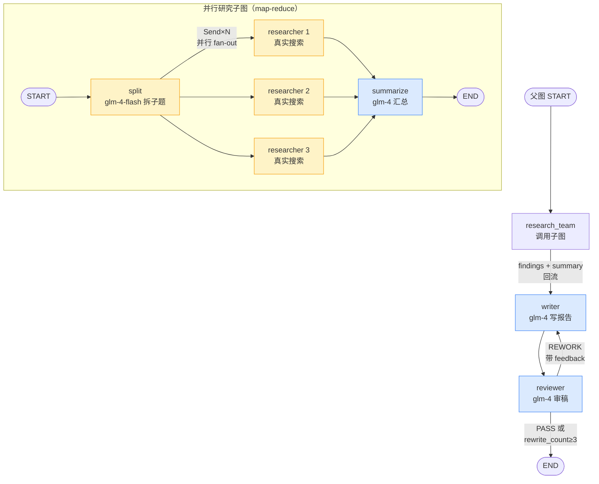

# 🔬 AI 研究分析助手

> **一句话**：基于 LangGraph 的多智能体并行研究系统——输入研究主题，自动拆解、并行联网检索、智能汇总、审稿迭代，产出带真实来源的结构化研究报告，以流式 API 服务对外提供。

这是 [36 课 LLM 应用实战课程](../../README.md) 的**生产级落地项目**：把课程里学到的 RAG / Agent / 多智能体编排 / 框架工程化能力，缝合成一个**真正可上生产**的 AI 应用。由课程毕业项目 [`workflow-lessons/09_capstone`](../../workflow-lessons/09_capstone/)（教学原型）演进而来，补齐了 8 个生产缺口。

---

## ✨ 核心特性

| 特性 | 说明 | 对应生产缺口 |
|------|------|------|
| 🔍 **真实联网搜索** | DuckDuckGo 检索 + 来源溯源，非 LLM 凭记忆"编" | 替代教学版的幻觉回答 |
| ⚡ **多智能体并行** | N 个 researcher 用 LangGraph `Send` 同时检索不同子问题 | 串行 → 并行，约 2-3× 加速 |
| 🔁 **审稿回路** | reviewer 节点评估报告质量，不合格带反馈回 writer 重写 | 补齐 supervisor 自我迭代逻辑 |
| 🧠 **多模型路由降本** | glm-4-flash 跑并行检索（免费）+ glm-4 跑写作/审稿（质量）| 约 80% 成本节省 |
| 💾 **跨重启持久化** | SqliteSaver 落盘，进程重启后会话记忆不丢 | 替代 InMemorySaver 进程即丢 |
| 📡 **SSE 双层流式** | 进度事件（节点级）+ token 流（逐字输出）同时推送 | 无流式 → 实时反馈 |
| 🌐 **FastAPI 服务化** | REST + SSE，自带前端页面，Docker 一键部署 | 脚本 → 生产服务 |
| 🚦 **并发限流** | Semaphore 控制 web_search QPS，防搜索 API 封禁 | 抗突发流量 |
| 📊 **结构化日志** | 节点进出 + 耗时 + 结果摘要，可接 ELK/Loki | 可观测性 |
| ✅ **219 单元测试** | 不联网、不调真实 LLM、不污染生产 db（基础 25 + frontier 79 + GUI 19 + AgentOps 96）| 可回归 |

---

## 🏗️ 架构

### 双层图：并行研究子图 + 审稿父图

```
┌─────────────── 并行研究子图（map-reduce）─────────────────┐
│                                                            │
│  START → split ──(Send×N fan-out)──→ researcher ──→ summarize ──→ END
│         (glm-4-flash              (glm-4-flash      (glm-4
│          拆子题)                   +真实搜索          汇总)
│                                   +Semaphore限流)          │
└──────────────────────┬─────────────────────────────────────┘
                       │ 子图作为节点（共享 State 回流）
                       ▼
┌─────────────── 父图（审稿回路 + 持久化）──────────────────┐
│                                                            │
│  START → research_team → writer → reviewer ──(条件)─→ PASS → END
│                          (glm-4)  (glm-4        │
│                                   审质量)        └→ REWORK → writer
│                                                  (rewrite_count++,
│                                                   >=3 强制 PASS)
│                                                            │
│  ⭐ SqliteSaver（Checkpointer）跨轮/跨重启记忆            │
└────────────────────────────────────────────────────────────┘
```

<details>
<summary>Mermaid 源码（可粘贴到 mermaid.live 渲染）</summary>


</details>

### 通信机制（三种，对应课程 L05）

- **共享 State**：`findings` 字段 + `operator.add` reducer，子图并行结果自动拼接回流父图
- **消息传递**：`messages` 字段 + `add_messages` reducer，writer 输出经 Checkpointer 跨轮记忆
- **条件路由**：reviewer 通过条件边把 feedback 传回 writer（结构化反馈通道）

---

## 🎯 关键设计决策（面试高频）

### 1. 为什么双层图 + 子图作为节点？

**答**：并行研究是一个内聚的子系统（拆题→并行检索→汇总），封装成子图后，父图只需关心「研究 → 写作 → 审稿」的主流程。子图作为节点嵌入父图（LangGraph 的 `add_node` 接受已编译的图），父图 State 通过共享字段 `findings` 自动接收子图结果。好处：**关注点分离 + 可独立测试子图 + 父图流程清晰**。

### 2. 为什么用 SqliteSaver 而不是 InMemorySaver？

**答**：InMemorySaver 进程退出即丢——开发够用，生产不行。SqliteSaver 把 checkpoint 落本地文件，**进程重启 / 容器重建后会话记忆不丢**。本项目用 `AsyncSqliteSaver`（因为图走 async 路径，同步 SqliteSaver 不支持 `aget_tuple`）。生产规模再大可换 `PostgresSaver`，接口一致。

### 3. 为什么 SSE 双层流（progress + token）？

**答**：用户要两种实时反馈——「现在研究到哪了」（进度）+「报告逐字流出」（体验）。LangGraph 的 `astream(stream_mode=["updates", "messages"])` **单次流同时产出两类事件**：updates 模式给节点级进度，messages 模式给 LLM 逐 token 输出。前端据此渲染进度条 + 打字机效果。关键坑：writer 必须在父图顶层（不在嵌套子图），否则 token 流不传播（[langgraph#6105](https://github.com/langchain-ai/langgraph/issues/6105)）。

### 4. 多模型路由怎么省钱？

**答**：3 个并行 researcher 是调用大户（每个都联网 + 调 LLM），用免费的 `glm-4-flash`；只有质量关键的 summarize / writer / reviewer 用 `glm-4`。对比全用 glm-4，约省 80% 成本。

### 5. 审稿回路怎么防死循环？

**答**：reviewer 节点带 `rewrite_count` 计数器，每次重写 +1，达到 `MAX_REWRITES=3` 强制 PASS。条件边 `review_route` 检查 `decision == "pass" or rewrite_count >= max_rewrites` → END，否则 → writer。

### 6. 为什么 async 全链路？

**答**：researcher 节点要真实联网（web_search 是 async，配合 Semaphore 限流）。LangGraph 规则：**图里有 async 节点 → 整条调用链必须 async**（ainvoke / astream）。这恰好为 SSE 流式（本身就是 async）铺平了路。

---

## 🚀 快速开始

### 本地运行

```bash
# 1. 配置 API Key（从仓库根的 .env，或在此目录建 .env）
cp .env.example .env
# 编辑 .env，填入 ZHIPUAI_API_KEY（获取：https://bigmodel.cn/）

# 2. 安装依赖
make install          # 或 pip install -r requirements.txt

# 3a. 启动 Web 服务（推荐）
make run              # 或 python -m uvicorn api.main:app --reload
# 浏览器打开 http://localhost:8000

# 3b. 或用 CLI
make cli              # 默认主题
make cli T="你的研究主题"
```

### Docker 部署

```bash
# 配好 .env 后
cp .env.example .env  # 填 ZHIPUAI_API_KEY
make docker-up        # docker compose up -d
# 浏览器打开 http://localhost:8000，记忆持久化在 ./data/ 卷
make docker-down      # 停止
```

> 重启容器后会话记忆不丢（sqlite 挂载在 volume），这是相对教学版的核心生产能力。

---

## 📡 API 文档

启动服务后访问 `http://localhost:8000/docs` 看交互式文档（FastAPI 自动生成）。

### `POST /api/research`（SSE 流式）

**请求**：
```json
{ "topic": "2024 年 AI Agent 技术进展", "thread_id": "可选，用于记忆/隔离" }
```

**响应**：`text/event-stream`，事件类型：

| event | data | 说明 |
|-------|------|------|
| `progress` | `{node, label, status, ...}` | 节点级进度（研究完成/报告生成/审稿通过）|
| `token` | `{node, content}` | writer 逐 token 输出（打字机效果）|
| `done` | `{report, findings, review_decision, rewrite_count}` | 最终结果 |
| `error` | `{message}` | 异常 |

**前端示例**见 [`static/index.html`](static/index.html)（fetch + ReadableStream 解析 SSE）。

### `GET /api/health`

```json
{ "status": "ok", "persistent": true, "smart_model": "glm-4", "fast_model": "glm-4-flash" }
```

---

## 📁 项目结构

```
research-assistant/
├── README.md                     ← 你在这里
├── cli.py                        ← CLI 入口（调试用）
├── Dockerfile / docker-compose.yml / Makefile
├── requirements.txt / .env.example / pytest.ini
├── src/research_assistant/
│   ├── config.py                 ← pydantic-settings 配置中心
│   ├── state.py                  ← ResearchState / SystemState（TypedDict + reducer）
│   ├── models.py                 ← 多模型工厂（smart/fast）
│   ├── tools.py                  ← web_search（真实搜索 + 限流 + 兜底）
│   ├── nodes.py                  ← split/researcher/summarize/writer/reviewer
│   ├── graph.py                  ← 双层图组装（依赖注入）
│   ├── persist.py                ← SqliteSaver / AsyncSqliteSaver 工厂
│   ├── service.py                ← 服务层（invoke + stream_research）
│   └── logging_config.py         ← 结构化日志（timed_node 装饰器）
├── api/
│   ├── main.py                   ← FastAPI app（lifespan + 路由）
│   └── schemas.py                ← Pydantic 请求/响应模型
├── static/index.html             ← 极简聊天前端
└── tests/                        ← 219 个单元测试（不联网/不调真实 LLM）
```

---

## 🔗 课程能力复用映射（证明深度）

本项目不是空中楼阁——每一项技术都来自前 36 课的扎实学习：

| 本项目能力 | 来源课程 | 具体技术 |
|-----------|---------|---------|
| 并行 map-reduce | workflow L04 | `Send` fan-out + `operator.add` reducer |
| 子图作为节点 | workflow L03 | `research_subgraph` 嵌入父图 |
| 共享 State 通信 | workflow L05 | `findings` 字段跨层回流 |
| 多模型路由 | workflow L06 | glm-4 / glm-4-flash 分工 |
| 审稿条件边 | workflow L01 | supervisor 动态路由思想 |
| Checkpointer | framework L08 | 跨轮记忆（升级到持久化）|
| Mermaid 可视化 | framework L09 | `graph.get_graph().draw_mermaid()` |
| LangGraph StateGraph | framework L06 | 节点 + 边 + 条件路由 |
| 联网搜索 | agent L09 | DuckDuckGo（升级到 async + 限流）|
| 工具错误兜底 | agent L04 | try/except 返回友好提示 |
| LCEL / ChatZhipuAI | framework L01-L02 | LLM 调用抽象 |

---

## 💼 简历话术

### 一句话版

> 基于 LangGraph 的多智能体并行研究系统，支持真实联网检索、审稿迭代、SSE 流式输出、SqliteSaver 持久化，Docker 一键部署。

### 三句话版（简历项目栏）

> **AI 研究分析助手**（Python · LangGraph · FastAPI · Docker）
> - 设计双层 LangGraph 图（并行研究子图 + 审稿父图），3 个 researcher 用 `Send` 并行检索，配合 Semaphore 限流，相比串行约 2-3× 加速
> - 多模型路由降本（glm-4-flash 并行执行 + glm-4 决策写作，省约 80% 成本）+ reviewer 审稿回路（条件边 + 防死循环）提升报告质量
> - FastAPI + SSE 双层流式（进度 + token 逐字输出），SqliteSaver 跨重启持久化，219 单元测试，Docker 一键部署

### 面试深聊版（按考点展开）

- **架构选型**：「为什么用双层图？」→ 关注点分离 + 子图可独立测试 + 父图流程清晰
- **性能优化**：「多模型怎么省钱？」→ 执行类节点用免费 flash，质量类用 glm-4，成本省 80%
- **流式设计**：「SSE 双层怎么实现？」→ `astream(stream_mode=["updates","messages"])` 单流双模式，规避嵌套子图 token 不传播的坑
- **工程化**：「怎么上生产？」→ 异步全链路（async 图必须配 AsyncSqliteSaver）+ Docker volume 持久化 + 健康检查 + 结构化日志
- **质量保障**：「怎么测的？」→ mock LLM 测节点逻辑、真实图测拓扑、不联网不花钱 25 测试全绿

---

## 🧠 深度智能体（Frontier）

经 [frontier-lessons](../../frontier-lessons/)（智能体前沿课程，13 课）升级，research-assistant 从「搜索→写报告」的一次性系统，进化为 **Deep Research Agent v2**——有记忆、能反思、会写代码、跨会话进化的深度研究智能体。

### 五大前沿机制（每个默认关闭，可独立开关）

| 机制 | 课程 | 核心能力 | 开关 |
|------|------|---------|------|
| 🧠 **记忆分层** | [L01-L02](../../frontier-lessons/01_memory/) | 情景(Chroma)+语义(list) MemoryStore，researcher 研究前 recall 旧经验，第二次研究同一主题记得第一次查过什么。反思式写入提炼记忆 + 巩固 + 遗忘。 | `enable_memory` |
| 📋 **Skills 渐进式加载** | [L03](../../frontier-lessons/03_skills/) | 能力做成文件夹（SKILL.md），Agent 先看一行描述（不占窗口），用到时才加载全文。记忆/skills/RAG/MCP 统一到上下文工程。 | `enable_skills` |
| 🔄 **双通道反思** | [L04-L05](../../frontier-lessons/05_reflection_research/) | reviewer 升级双通道：文字不合格→重写；事实冲突（新旧结论矛盾）→定向补研→报告写修正说明。Agent 不只改错字，还改错误认知。 | `enable_memory` |
| 💻 **代码解释器** | [L06-L07](../../frontier-lessons/07_code_interpreter/) | 数值对比/统计走沙箱代码执行（import 白名单+超时+截断），报告附可复算脚本。数字可信度质变。 | `enable_code_interpreter` |
| 📊 **任务账本** | [L10](../../frontier-lessons/10_long_task/) | TODO 树 sqlite 持久化 + 断点续跑（接着上次做）+ 增量简报（🆕新增/✏️修正/➡️不变）。跨会话推进长任务。 | `enable_ledger` |

### 评估体系（机制收益量化）

- **轨迹评估器**（[L08](../../frontier-lessons/08_trajectory_eval/)）：成功率/步数效率/工具正确率/循环检测/失败归因 + 机制触发检测
- **Eval Harness**（[L09](../../frontier-lessons/09_eval_harness/)）：开关矩阵 × 8 任务变体 = 机制收益表（`eval_agent/REPORT.md`）
- 对照 [L00 裸基线](../../frontier-lessons/00_method/)：从失忆→记得、从口算→可复算、从重写→增量

### 架构文档

详见 [`docs/deep-agent-v2.md`](docs/deep-agent-v2.md)——五机制协同图 + 一次运行的数据流 + 开关与降级路径。

### 测试覆盖

104 个单元测试（原 25 + frontier 新增 79），所有开关组合下全绿。新增测试覆盖：记忆(18) / skills(13) / 代码解释器(15) / 轨迹评估(15) / 任务账本(12) / 双通道节点(6)。

---

## 🖥️ 会上网的研究智能体（GUI Agent）

经 [gui-agent-lessons](../../gui-agent-lessons/)（GUI Agent / Computer Use 课程，13 课）升级，research-assistant 从「只看搜索摘要」升级到**真开浏览器进详情页取证**——给它长出一双稳、安全、可评估的「手」。

### Browser 四层（手写 + 落地封装）

| 层 | 课程 | 核心能力 | 落地 |
|----|------|---------|------|
| 👁️ **观察空间** | [L02](../../gui-agent-lessons/02_observation/) | 元素编号列表（比原始 HTML 省 9x token）+ SoM 截图（混合路线） | `browser_tool.extract_from_page` |
| 🎯 **行动空间** | [L03](../../gui-agent-lessons/03_action/) | 受限 DSL（click/type/scroll/back/finish），可校验可白名单 | 简化为直接选择器提取 |
| 🛡️ **可靠性** | [L06](../../gui-agent-lessons/06_reliability/) | 循环检测（观察哈希）+ 换策略 + 重试预算 + 人工接管点 | 超时兜底 + 降级链 |
| 🔒 **安全**（默认开） | [L07](../../gui-agent-lessons/07_injection/) | 域名 allowlist + 敏感动作确认 + 注入扫描——**不随 enable_browser 开关** | `SecurityLayer` 内置 |

### 工具分层：search vs browse

| 工具 | 速度 | 深度 | 成本 | 用在 |
|------|------|------|------|------|
| `web_search`（ddgs） | 快 | 浅（摘要） | 低 | 打头：每个子问题都搜，拿候选链接 |
| `browse_for_evidence` / `deep_browse` | 慢 | 深（详情页/翻页/取证） | 高 | 深挖：从候选链接挑 allowlist 内的，真开浏览器提取 |

流程：researcher 先 `web_search` 拿摘要+链接 → `enable_browser` 时挑 allowlist 内 URL → `browse_for_evidence` 进详情页提取 → 证据附进 finding。**降级链**：browse 失败 → 回退 search 摘要（研究流程不断）。

### 证据链（报告可信度第二次升级）

每条证据带 **URL + 访问时间 + 页面快照**，报告引用格式：`结论（[来源](URL)，访问于 YYYY-MM-DD HH:MM UTC）`。与 frontier L07「数字可复算」呼应——**数字可复算 + 来源可回访** = 可审计的深度研究。

### 评估（mini-benchmark）

- **本地 mini-benchmark**（[L08](../../gui-agent-lessons/08_benchmark/)）：8 任务（搜索/翻页/详情/动态渲染/弹窗/刁难/注入/多步）+ 功能性验收（WebArena 思路：查终态不评文本）
- 对照 [L00 裸基线](../../gui-agent-lessons/00_overview/)：任务成功率 75%→100%、引用可回访率 0%→100%、注入失守率 100%→0%

### 架构文档

详见 [`docs/browser-agent.md`](docs/browser-agent.md)——四层全景图 + 与 frontier 五机制协作 + 数据流 + 开关降级 + 收益表 + 安全红线。

### 测试覆盖（更新）

**123 个单元测试**（原 104 + GUI Agent 新增 19），所有开关组合下全绿。新增测试覆盖：browser 安全层 / 降级链 / 证据格式 / 单例开关 / deep_browse 多步取证。`enable_browser` 默认关，开启需 playwright + chromium。

---

## 🛡️ 生产可靠性（AgentOps v3）

经 [agent-ops-lessons](../../agent-ops-lessons/)（Agent 生产可靠性课程，10 课）升级，research-assistant 从「能力完整但跑飞了没人管」升级为**生产可靠 v3**——故障下可生存、危险动作有门控、崩溃可恢复、可靠性有 SLO 数字。

> ops-lessons 护的是一次**请求**（kb-qa 的鉴权限流守护栏）；本课护的是一条**轨迹**（Agent 会自己转很多圈、自己决定下一步）。kb-qa 是线性链用不上这些机制，research-assistant 是循环体非用不可——这个不对称本身就是边界证据。

### 七机制治理架构（每个默认关闭，可独立开关 + 降级）

| 机制 | 课程 | 核心能力 | 开关 | 兜住的故障 |
|------|------|---------|------|-----------|
| 📏 **全局步数预算** | [L01](../../agent-ops-lessons/01_step_budget/) | add_int reducer 累计步数 + 动作签名循环检测 + 诚实收尾 | `enable_step_budget` | ③ 死循环 |
| 💰 **轨迹级成本预算** | [L02](../../agent-ops-lessons/02_cost_budget/) | usage_metadata 计量 + 软预算降级 flash / 硬预算诚实收尾 + 分节点分摊表 | `enable_cost_budget` | ⑤ 成本超支 |
| 🔌 **超时熔断与诚实降级** | [L03](../../agent-ops-lessons/03_breaker_degrade/) | 手写熔断器三态状态机 + 结构化降级协议 + 降级链 | `enable_circuit_breaker` | ①② 慢/坏工具 |
| 🔑 **副作用与幂等** | [L04](../../agent-ops-lessons/04_sideeffect_idempotent/) | 幂等键(thread_id+内容指纹) + sqlite 注册表 + dry-run + 可选 publish 节点 | `enable_publish` | ⑥ 危险副作用（重放） |
| 🚦 **人在环审批** | [L05](../../agent-ops-lessons/05_hitl_approval/) | interrupt/resume 门闸 + 策略分层(first_only) + 跨进程恢复 | `enable_hitl` | ⑥ 危险副作用（首次） |
| 🔄 **断点续跑** | [L06](../../agent-ops-lessons/06_durable_resume/) | jobs 注册表 + checkpoint 续跑(已完成不重做) + recover_orphans | `enable_job_registry` | ④ 进程崩溃 |
| 📊 **轨迹级可观测** | [L07](../../agent-ops-lessons/07_observability/) | run summary 一行体检报告 + 阈值告警 + 三层分层 | `enable_run_summary` | 可见性 |

### 开关与降级路径

所有七机制**默认关闭**——开关全关时行为与 v2 完全一致（纯净跑零税）。开启后只在故障下生效：

```
故障 × 兜住机制：
  ①慢工具   → L03 熔断快速失败 + 结构化降级（不污染材料）
  ②坏工具   → L03 同上（垃圾不混进 findings）
  ③循环诱导 → L01 步数预算诚实收尾（带部分结果退出）
  ④进程崩溃 → L06 checkpoint 续跑（重做量=最后一个未完成节点）+ L04 幂等不重放副作用
  ⑤预算炸弹 → L02 硬预算刹车（软预算先降级 flash）
  ⑥危险副作用 → L04 幂等挡重放 + L05 审批挡首次不该执行的
```

### 可靠性 SLO 卡（来自 [L08](../../agent-ops-lessons/08_chaos_eval/) 混沌收益矩阵）

| SLO 指标 | 全关（裸奔 v2） | 全开（v3） | 改善 |
|----------|----------------|-----------|------|
| 任务成功率（含诚实截断） | 33% | 100% | +67% |
| 预算超支率 | 17% | 0% | -17% |
| 副作用重复率 | 17% | 0% | -17% |
| 平均浪费 token | 11917 | 870 | -93% |

> ⚠️ **诚实标注**：以上为 mock 演示数字（基于 L00 裸基线的结构性结论）。真实 API 的绝对数字需 `--real` 模式跑，但「全关 vs 全开」的差异结构不变。复现：`python eval_agent/run_chaos_eval.py`。

### 版本演进

```
v1（多智能体）          v2（Deep Research）              v3（生产可靠）
能跑的搜索→写报告  →    有记忆/反思/CodeAct/浏览器  →   +步数/成本/熔断/幂等/审批/恢复/观测
rag/workflow 课程       frontier + gui-agent 课程        agent-ops 课程
```

与 kb-qa README 的三版本格式对齐——两个作品集项目现在是对称的：kb-qa 走了 RAG→运维→多模态，research-assistant 走了多智能体→深研究→生产可靠，每一步都有数字。

### 架构文档

详见 [`docs/production-reliability.md`](docs/production-reliability.md)——七机制在双层图上的位置 + 开关降级路径表 + 混沌收益矩阵 + SLO 卡 + v1→v2→v3 演进图。

### 测试覆盖（更新）

**219 个单元测试**（原 123 + AgentOps 新增 96），所有开关组合下全绿。新增测试覆盖：步数预算(16) / 成本预算(17) / 熔断器(15) / 幂等发布(14) / HITL 审批(8) / 断点续跑(11) / run summary(15)。所有新机制默认关、可降级，纯净跑零税。

---

## ⚠️ 已知限制 & 后续演进

| 限制 | 影响 | 演进方向 |
|------|------|---------|
| 追问会当新主题研究（父图 START 固定连 research_team）| 纯聊天场景体验一般 | 加路由节点判断「研究 vs 闲聊」 |
| SqliteSaver 单机 | 多实例无法共享会话 | 换 PostgresSaver（接口一致）|
| DuckDuckGo 国内不稳 | 部分子题检索可能降级到模型知识 | 接 SerpAPI / Bing / 自建搜索 |
| 无 RAG 私有文档检索 | 研究依赖公网搜索 | researcher 加企业知识库检索层 |
| 无全链路 trace | 线上问题定位偏日志 | 接 LangSmith |

---

## 🧪 开发

```bash
make test          # 跑测试（25 个，约 10s）
make lint          # 语法检查所有源码
make clean         # 清理临时文件
```

测试原则：不调真实 LLM（用 mock）、不联网（测错误兜底路径）、不污染生产 db（用 InMemorySaver）。

---

## 📜 技术栈

- **框架**：LangGraph 1.2.7（图编排）+ FastAPI 0.139（服务化）+ sse-starlette（SSE）
- **LLM**：智谱 GLM-4 / glm-4-flash（多模型路由）
- **检索**：ddgs（DuckDuckGo，国内可用的更名包）
- **持久化**：langgraph-checkpoint-sqlite 3.1 + AsyncSqliteSaver（aiosqlite）
- **配置**：pydantic-settings（从 .env 读）
- **测试**：pytest + pytest-asyncio

---

*本项目是 [36 课 LLM 应用实战课程](../../README.md) 的生产级收官作品——从「会写 Agent」到「能交付生产级 AI 应用」。*
